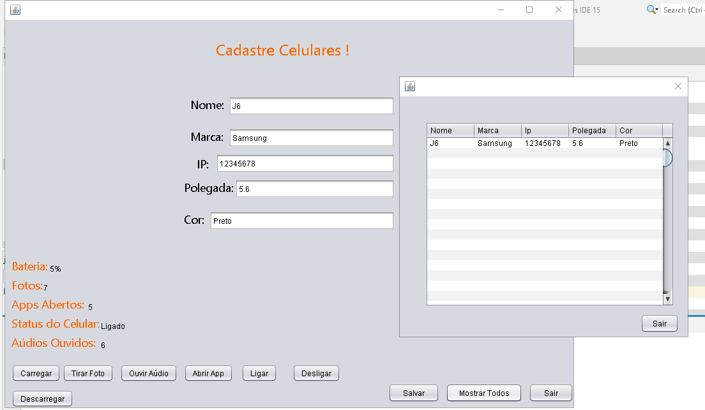

# E2-LP1-Lucas-Emanoel

## Atividade 2: Criar ArrayList, HashSet e Map
  

* Esta atividade engloba a primeira atividade;
* Com base na classe Celular, implementei o ArrayList, que serve para armanezar os atributos em um vetor;
* O HashSet compreende uma coleção que não possui repetição, no meu caso o que nunca pode repetir é o IP do Celular;
* Para finalizar temos o Map, que é um dicionário ao qual possui suas respectivas chaves e valores.

## Exemplo
;
